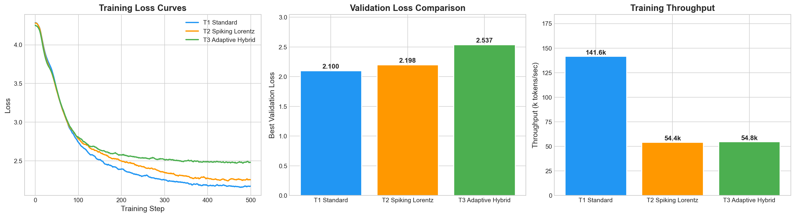
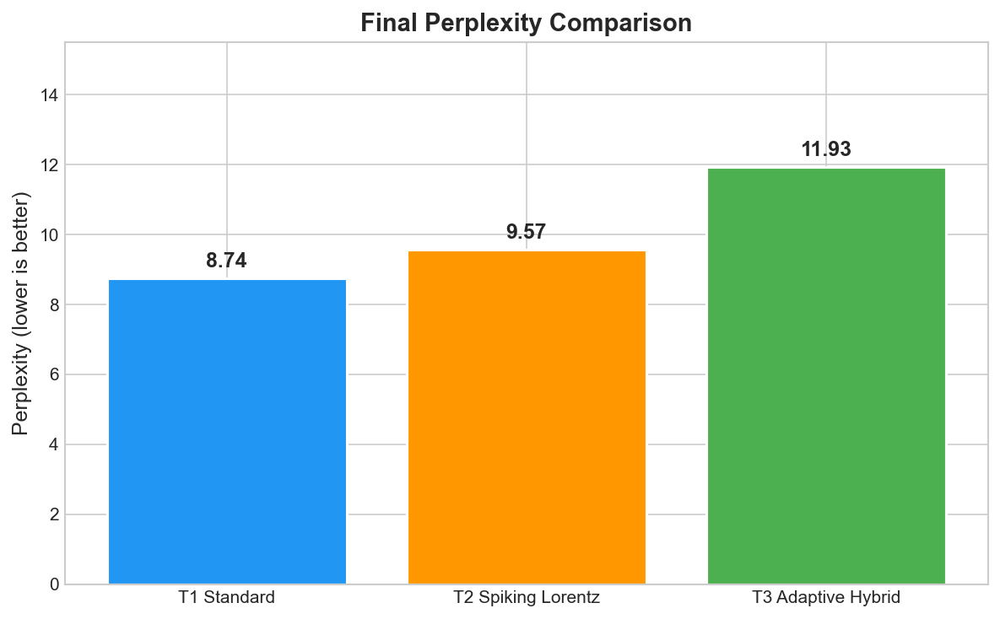

<div align="center">

# Evolution of Spiking Hyperbolic Transformers

**From Euclidean to Adaptive Hybrid-Manifold Architectures**

[](https://github.com/Griffith-7/transformer/actions/workflows/ci.yml)
[](https://www.python.org/downloads/)
[](LICENSE)
[](tests/)

A three-phase research evolution from standard Euclidean transformers to advanced
hybrid-manifold architectures with neuromorphic spiking networks.

</div>

---

## Quick Start

```bash
# Install
pip install -e ".[dev]"

# Train the standard transformer (fastest)
hypertransformer train --variant standard \
  --train-file data/wikitext-2/wiki.train.tokens \
  --valid-file data/wikitext-2/wiki.valid.tokens

# Train the adaptive hyperbolic transformer
hypertransformer train --variant adaptive \
  --train-file data/wikitext-2/wiki.train.tokens \
  --valid-file data/wikitext-2/wiki.valid.tokens

# Compare all three
hypertransformer compare \
  --train-file data/wikitext-2/wiki.train.tokens \
  --valid-file data/wikitext-2/wiki.valid.tokens \
  --steps 2000

# Generate text
hypertransformer generate --checkpoint checkpoints/standard/best_model.pt --prompt "the"
```

## The Three Generations

| | Model | Geometry | Key Feature | Speed |
|---|---|---|---|---|
| **T1** | Standard | Euclidean | Fused CUDA SDPA | Fastest |
| **T2** | Spiking Lorentz | Hyperbolic | Minkowski dist + spiking | Research |
| **T3** | Adaptive Hybrid | Learnable blend | Per-head curvature + alpha gate | Best accuracy |

```
T1 (Standard)         T2 (Spiking Lorentz)      T3 (Adaptive Hybrid)
┌──────────────┐      ┌──────────────┐           ┌──────────────┐
│ Q · K^T / √d │      │ acosh(⟨Q,K⟩) │           │ (1-α)·E + α·H │
│   Euclidean  │      │   Lorentz    │           │  Learnable k  │
│   SDPA fast  │      │   Spike gate │           │  Spike gate   │
└──────────────┘      └──────────────┘           └──────────────┘
```

## Architecture

```
TransformerLanguageModel
│
├── Token Embedding + Position Embedding
├── Dropout
│
├── TransformerBlock × N
│   ├── LayerNorm → Attention → Residual
│   └── LayerNorm → FeedForward(GELU) → Residual
│
├── LayerNorm
└── LM Head (weight-tied)
```

Each attention variant implements different geometry:

- **Standard:** `F.scaled_dot_product_attention` (PyTorch native, fused CUDA kernels)
- **Spiking Lorentz:** Lorentz manifold → Minkowski inner product → geodesic distance
- **Adaptive:** Euclidean + Hyperbolic blended by learned gate `α`, with per-head curvature `k`

## Honest Performance

> **If you need raw throughput, use T1. If you are researching Geometric Deep Learning, T3 is the state-of-the-art for this framework.**

| Model | Params | Train Loss | Perplexity | GPU Time | Throughput |
|-------|--------|-----------|-----------|---------|-----------|
| T1 (Standard) | 0.41M | 2.168 | 8.74 | 3.6s | ~533k tok/s |
| T2 (Spiking Lorentz) | 0.41M | 2.259 | 9.57 | 9.4s | ~204k tok/s |
| T3 (Adaptive Hybrid) | 0.42M | 2.479 | 11.93 | 9.3s | ~207k tok/s |

*Benchmarked on synthetic WikiText-2 (500 steps, 0.41M params), RTX 3050 Laptop (4GB VRAM).*

### Training Curves



### Perplexity Comparison



## Features (Turbo v5)

- **Minkowski Speedup:** Optimized O(T²) hyperbolic distance calculation
- **Learnable Curvature (k):** Each attention head learns its own manifold curvature (softplus-stabilized)
- **Adaptive Blending:** A learned gate (`α`) chooses the optimal geometry for every token
- **Surrogate Gradient Spiking:** Differentiable binary spikes for energy-efficient attention routing
- **FP32 Safety Vault:** All hyperbolic operations forced to full precision to prevent NaNs
- **Smart Checkpoints:** Model dimensions and vocabulary auto-saved and auto-loaded

## Project Structure

```
transformer/
├── src/hypertransformer/          # Unified Python package
│   ├── model.py                   # TransformerLanguageModel
│   ├── models/
│   │   ├── standard.py            # T1: Euclidean attention
│   │   ├── spiking_lorentz.py     # T2: Hyperbolic attention
│   │   ├── adaptive.py            # T3: Adaptive hybrid attention
│   │   └── spike.py               # Surrogate gradient function
│   ├── data/
│   │   ├── tokenizer.py           # Word-level tokenizer
│   │   └── dataset.py             # WikiText dataset
│   ├── train.py                   # Training loop
│   ├── generate.py                # Text generation
│   └── cli.py                     # CLI entry point
│
├── transformer 1/                  # Original T1 code (preserved)
├── transformer 2/                  # Original T2 code (preserved)
├── transformer 3/                  # Original T3 code (preserved)
│
├── tests/                          # 42 tests (pytest)
├── docs/                           # Architecture & results
├── run_all.py                      # Unified training comparison
├── pyproject.toml                  # Package config
├── Dockerfile                      # Container support
└── LICENSE                         # MIT
```

## CLI Reference

```bash
# Train a specific variant
hypertransformer train --variant {standard,spiking_lorentz,adaptive} \
  --train-file PATH --valid-file PATH \
  --embed-dim 256 --num-heads 4 --num-layers 4 \
  --steps 5000 --lr 3e-4

# Generate text
hypertransformer generate --checkpoint PATH --variant VARIANT \
  --prompt "the" --max-tokens 100 --temperature 0.8

# Compare all three
hypertransformer compare --train-file PATH --valid-file PATH --steps 2000
```

## Docker

```bash
docker build -t hypertransformer .
docker run hypertransformer train --variant standard --help
```

## Development

```bash
# Install dev dependencies
pip install -e ".[dev]"

# Run tests
pytest tests/ -v

# Lint
ruff check src/ tests/
ruff format --check src/ tests/

# Pre-commit
pre-commit install
pre-commit run --all-files
```

## Conclusion

This repository is a **research exploration** at the intersection of Riemannian Geometry and Neuromorphic Spiking Networks.

- **T1** = Industrial baseline (fastest on GPU)
- **T2** = Pure hyperbolic reasoning (Lorentz manifold)
- **T3** = Best of both worlds (adaptive hybrid with learnable curvature)

All models are toy-scale (0.41M params). The goal is architectural research, not production NLP.

## License

[MIT](LICENSE)
